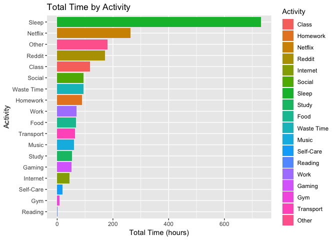
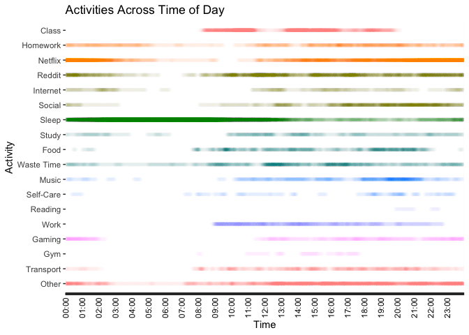

## Clean and Transform Data

The data outputted by the time tracker app is in a particularly ugly time-encoded CSV format, which looks like this:

```
activity,start,end,length
Homework,24 M02 2019 10:07,24 M02 2019 11:37,90
Other,24 M02 2019 09:37,24 M02 2019 10:07,30
Self-Care,24 M02 2019 09:29,24 M02 2019 09:37,8
...
```

First, we need to clean this up to a more reasonable format. We'll use the following Python script:


```python
# Open files
raw_data = open('data_raw.csv', 'r')
clean_data = open('data_clean.csv', 'w')
# Output header
clean_data.write('activity,start,end,minutes\n')
# Process line by line
line = raw_data.readline()
while line:
    parts = line.strip().split(',')
    # Example: Study,11 M12 2018 01:40,11 M12 2018 02:43,63
    # Parse
    activity_type = parts[0]
    start_raw = parts[1]
    end_raw = parts[2]
    minutes = parts[3]
    # Decode start and end times
    start_parts = start_raw.split(' ')
    start_day = start_parts[0]
    start_month = start_parts[1][1:]    # Ignore 'M'
    start_year = start_parts[2]
    start_time = start_parts[3]
    # Same for end
    end_parts = end_raw.split(' ')
    end_day = end_parts[0]
    end_month = end_parts[1][1:]    # Ignore 'M'
    end_year = end_parts[2]
    end_time = end_parts[3]
    # Prepare the output format
    out_start_date = '{}-{}-{}'.format(start_year, start_month, start_day)
    out_end_date = '{}-{}-{}'.format(end_year, end_month, end_day)
    out_start_time = start_time
    out_end_time = end_time
    out_line = '{},{} {},{} {},{}\n'.format(
        activity_type,
        out_start_date,
        out_start_time,
        out_end_date,
        out_end_time,
        minutes
    )
    # Write to output file
    clean_data.write(out_line)
    # Get the next line
    line = raw_data.readline()
# Clean up
raw_data.close()
clean_data.close()
```

This outputs a file that looks like this:

```
activity,start,end,minutes
Homework,2019-02-24 10:07,2019-02-24 11:37,90
Other,2019-02-24 09:37,2019-02-24 10:07,30
Self-Care,2019-02-24 09:29,2019-02-24 09:37,8
...
```

Next, let's run that through another Python script to convert the data to by-minute format:


```python
import datetime
# Open files
data = open('data_clean.csv', 'r')
data_minutes = open('data_minutes.csv', 'w')
# Output header
data_minutes.write('date_time,activity\n')
# Skip header line
_ = data.readline()
# Process line by line
line = data.readline()
while line:
    parts = line.strip().split(',')
    # Example: Study,2018-12-11 01:40,2018-12-11 02:43,63
    # Parse
    activity = parts[0]
    end_raw = parts[2]
    # Ignore end time
    minutes = int(parts[3])
    end_year = int(end_raw.split('-')[0])
    end_month = int(end_raw.split('-')[1])
    end_day = int(end_raw.split('-')[2].split(' ')[0])
    end_hour = int(end_raw.split(' ')[1].split(':')[0])
    end_minute = int(end_raw.split(' ')[1].split(':')[1])
    end = datetime.datetime(end_year, end_month, end_day, end_hour, end_minute)
    current_time = end
    # Write all those minutes of time
    for x in range(minutes):    # Make sure not to count last minute twice
        out_line = '{},{}\n'.format(current_time.strftime("%Y-%m-%d %H:%M"), activity)
        # Go backwards one minute
        current_time -= datetime.timedelta(minutes = 1)
        data_minutes.write(out_line)
    # Get the next line
    line = data.readline()
# Clean up
data.close()
data_minutes.close()
```

The data now looks like this:

```
date_time,activity
...
2019-02-24 09:39,Other
2019-02-24 09:38,Other
2019-02-24 09:37,Self-Care
2019-02-24 09:36,Self-Care
2019-02-24 09:35,Self-Care
...
```

Now, we can begin working in R.

### Load Packages


```r
library(tidyverse)
```

### Load Data


```r
minutes <- read.csv("data_minutes.csv", header = TRUE, stringsAsFactors = FALSE)
activities <- read.csv("data_clean.csv", header = TRUE, stringsAsFactors = FALSE)
```

Let's convert the `date_time`, `start`, and `end` columns to R `date` types:


```r
minutes <- minutes %>%
    mutate(date_time = as.POSIXct(date_time, format="%Y-%m-%d %H:%M", tz="EST"))

activities <- activities %>%
    mutate(start = as.POSIXct(start, format="%Y-%m-%d %H:%M", tz="EST")) %>%
    mutate(end = as.POSIXct(end, format="%Y-%m-%d %H:%M", tz="EST"))
```

Then, clean up the activity names into factors:


```r
activities <- activities %>% 
    mutate(activity = as.factor(activity)) %>%
    mutate(activity = fct_relevel(activity, "Class", "Homework", "Netflix", "Reddit", "Internet", 
                                            "Social", "Sleep", "Study", "Food", "Waste Time", "Music", 
                                            "Self-Care", "Reading", "Work", "Gaming", "Gym", "Transport", 
                                            "Other"))

minutes <- minutes %>% 
    mutate(activity = as.factor(activity)) %>%
    mutate(activity = fct_relevel(activity, "Class", "Homework", "Netflix", "Reddit", "Internet", 
                                            "Social", "Sleep", "Study", "Food", "Waste Time", "Music", 
                                            "Self-Care", "Reading", "Work", "Gaming", "Gym", "Transport", 
                                            "Other"))
```

We will also make a new data frame to hold hourly summaries of time spent in each activity:


```r
hours <- minutes %>%
    mutate(hour = format.POSIXct(date_time, format = "%Y-%m-%d %H")) %>%
    group_by(hour) %>%
    count(activity) %>%
    spread(activity, n, fill = 0)
```

## Visualizations

Let's look at the distribution of total time spent in each activity:


```r
activities %>% 
    group_by(activity) %>%
    summarize(total_time = sum(minutes) / 60) %>%
    ggplot(aes(x = reorder(activity, total_time), y = total_time, fill = activity)) +
        geom_bar(stat = "identity") +
        coord_flip() +
        labs(title = "Total Time by Activity", x = "Activity", y = "Total Time (hours)", fill = "Activity")
```

<!-- -->

How about the time of day that certain activities usually occur?


```r
ggplot(minutes, aes(x = fct_rev(activity), 
                                    y = format.POSIXct(date_time, "%H:%M"), 
                                    color = activity)) +
    geom_point(alpha = 0.008) +
    theme(axis.text.x = element_text(color = rep(c("black", rep("transparent", each = 59)), 24))) +
    theme(axis.text.x = element_text(angle = 90, vjust = 0.5, hjust = 1)) +
    guides(color = FALSE) +
    labs(title = "Activities Across Time of Day", 
         x = "Activity", y = "Time", color = "Activity") +
    coord_flip()
```

<!-- -->

Perhaps this could be better represented as a series of faceted pseudo-violin plots:


```r
minutes %>% #sample_n(1000) %>%
    ggplot(aes(x = fct_rev(activity), y = factor(format.POSIXct(date_time, "%H:%M")), group = activity, fill = activity, color = activity)) +
    theme(axis.text.x = element_text(color = rep(c("black", rep("transparent", each = 59)), 24))) +
    theme(axis.text.x = element_text(angle = 90, vjust = 0.5, hjust = 1)) +
    #geom_jitter(alpha = 0.1, height = 0, width = 0.1) +
    geom_violin() + 
    coord_flip()
```

<!-- -->

## Trends Over Time

Now, we'll create a faceted visualization showing trends in each activity, over time:


```r
activities %>%
    mutate(week = format.POSIXct(start, "%Y-%W")) %>%
    group_by(week, activity) %>%
    summarize(weekly_total = sum(minutes) / 60) %>%
    ggplot(aes(x = week, y = weekly_total, color = activity, group = activity)) +
        geom_point() +
        geom_smooth(se = FALSE, span = 0.5) + 
        facet_grid(activity ~ .) +
        labs(title = "Weekly Trends per Activity", x = "Week", y = "Total Time (hours)") +
        theme(axis.text.x = element_text(angle = 90, vjust = 0.5, hjust = 1))
```

```
## `geom_smooth()` using method = 'loess' and formula 'y ~ x'
```

<!-- -->

## Other Activites' Effect on Sleep

What other activities might affect sleep patterns? Let's look at how a few compare.

First, we'll make a scatterplot of average daily Netflix time versus sleep time:


```r
activities %>%
    filter(activity %in% c("Sleep", "Netflix")) %>%
    mutate(day = format.POSIXct(start, "%Y-%m-%d")) %>%
    group_by(day, activity) %>%
    summarize(daily_total = sum(minutes) / 60) %>%
    spread(activity, daily_total, fill = NA) %>%
    drop_na() %>%
    ggplot(aes(x = Netflix, y = Sleep)) +
        geom_jitter() +
        geom_smooth() +
        labs(title = "Netflix has No Effect on Sleep", 
             x = "Netflix (hours)", y = "Sleep (hours)")
```

```
## `geom_smooth()` using method = 'loess' and formula 'y ~ x'
```

<!-- -->

Okayt, seems fair. How about homework?


```r
activities %>%
    filter(activity %in% c("Sleep", "Homework")) %>%
    mutate(day = format.POSIXct(start, "%Y-%m-%d")) %>%
    group_by(day, activity) %>%
    summarize(daily_total = sum(minutes) / 60) %>%
    spread(activity, daily_total, fill = NA) %>%
    drop_na() %>%
    ggplot(aes(x = Homework, y = Sleep)) +
        geom_jitter() +
        geom_smooth() +
        labs(title = "Homework's Effect on Sleep", 
             x = "Homework (hours)", y = "Sleep (hours)")
```

```
## `geom_smooth()` using method = 'loess' and formula 'y ~ x'
```

<!-- -->
